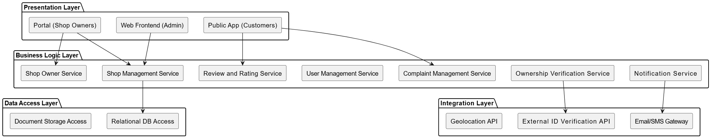
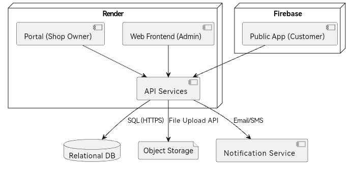
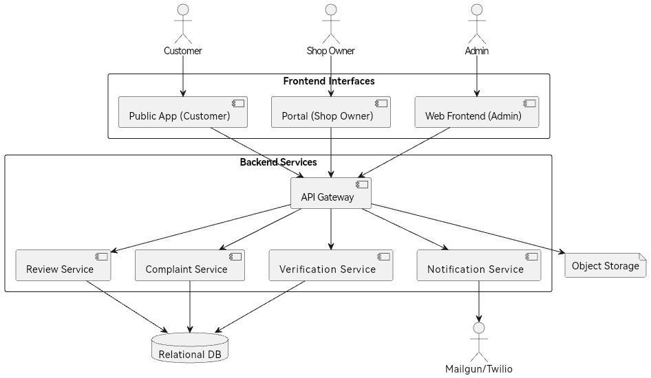

# Service Layer Breakdown

The SSRMS system is organized into the following logical service layers to promote
separation of concerns, scalability, and maintainability.

## Layered Architecture Diagram

## Responsibilities by Layer

Presentation Layer

- Web Frontend (Admin): Interface for regulatory officials to manage shop records,
    verify ownership, manage complaints, and monitor system reports.
- Public App (Customers): Public-facing app for users to view verified shops, file
    complaints, and leave reviews.
- Portal (Shop Owners): 
    - Register and manage shop profiles.
    - Upload documents (ID, business licenses).
    - Track approval status.
    - Respond to complaints or ratings.

Business Logic Layer

- Shop Management Service: Manages registration workflows, status tracking, and
    data validation.
- Ownership Verification Service: Enforces ownership limits and checks citizenship
    status.
- Complaint Management Service: Accepts and processes complaints, routes
    critical cases to authorities.
- User Management Service: Manages login, user roles (admin, owner, customer),
    authentication.
- Shop Owner Service: Manages owner identity, links to shop entities, and tracks
    ownership count.
- Review and Rating Service: Captures and displays public feedback.
- Notification Service: Delivers alerts to owners and admins via email/SMS.

Data Access Layer

- Relational DB Access: Interfaces with relational database for structured data
    (shops, users, complaints, reviews).
- Document Storage Access: Manages file storage for IDs, shop licenses.

Integration Layer

- External ID Verification API: Connects to mock or real ID verification system for
    validating citizens/non-citizens.
- Email/SMS Gateway: Sends notifications via a communication service.
Geolocation API: Converts shop addresses to latitude/longitude.

# Deployment Model

The SSRMS will be deployed as a modular, cloud-hosted application using containerized
services. The architecture follows a microservices-inspired pattern using free-tier or low-
cost cloud resources for scalability, security, and maintainability.

## Deployment Style

- Architecture: Modular deployment using containerized services
- Pattern: Microservices-inspired (service separation without excessive orchestration)
- Deployment Tools: Docker, CI/CD via GitHub Actions, Render/Supabase for hosting
- Environments: Development, Staging, Production

## Deployment Environment

- Cloud Hosting: Primarily Render.com, Supabase.io, and Firebase (all free-tier
    capable).
- Storage: Relational DB (Supabase), Object Storage (Supabase Storage or Firebase
    Storage).
- Authentication: Supabase Auth (email/password, OTP),
- Container Management: Docker-managed containers deployed to Render.

## Components & Hosting

|     Component                    	  |     Hosting   Platform                	|     Notes                                               	        |
|----------------------------------	  |---------------------------------------	|---------------------------------------------------------	|
|     Web   Frontend (Admin)        |     Render   (Static Site)            	|     React/Vite   or similar static frontend        |
|     Public App (Customers)       	  |     Firebase/Supabase Hosting       |     PWA or Capacitor Hybrid App                     |
|     Portal   (Shop Owners)       	  |     Render   (Static Site)            	|     Responsive   frontend, separate route       |
|     API Gateway / Backend API   |     Render (Docker App)               	|     Express.js or FastAPI microservices            |
|     Database   (Relational)      	 |     Supabase   DB                     	        |     Managed DB   (free tier)                            	|
|     File Storage                 	         |     Supabase Storage                  	|     For ID docs, shop images                            	|
|     Notification   Service       	 |     Mailgun   / Twilio                	        |     Free-tier   for transactional SMS/email      |

## Deployment Diagram

## Security & Availability Considerations

- Authentication: JWT tokens issued via Supabase Auth.
- Access Controls: Role-based access for Admins, Owners, and Public.
- Secure Communications: All traffic over HTTPS.
- Database Backups: Automatic daily backups via Supabase.
- Failover & Redundancy: Basic covered by cloud provider (Render, Supabase).
- Firewalls: Inherent in managed hosting environments.

# Communication Between Components

This section describes how SSRMS components communicate to ensure smooth
operation, enforce compliance, and support user interactions across interfaces.

## Component Interactions

- Frontend to Backend (All Interfaces):
    - Web Frontend (Admin), Portal (Shop Owner), and Public App (Customer) communicate with the API Backend via HTTPS.
    - All requests are stateless and authenticated via JWT (issued after login via Supabase Auth).
- API Backend to Database:
    - Structured data (shops, users, complaints, reviews) is accessed via SQL over HTTPS using a relational database.
- API Backend to File Storage:
    - Uploaded files (IDs, shop images) are stored in Supabase Storage via secure object storage APIs.
- Internal Service Communication:
    - Backend microservices (e.g., Complaint, Review, Notification services) communicate using internal HTTP calls (RESTful endpoints).
- External Service Communication:
    - Notification Service interacts with Mailgun or Twilio over HTTPS to send SMS/email alerts.
    - Ownership Verification Service may query a mock or third-party ID verification API.

## 3.2. Communication Types

|     Source                      |     Target                            |     Type             |     Protocol     |     Format        |
|---------------------------------|---------------------------------------|----------------------|------------------|-------------------|
|     Frontends                   |     API   Backend                     |     Synchronous      |     HTTPS        |     JSON          |
|     API Backend                 |     Relational Database               |     Synchronous      |     HTTPS/SQL    |     SQL           |
|     API   Backend               |     Object   Storage                  |     Synchronous      |     HTTPS        |     Multipart     |
|     API Backend                 |     Notification Services             |     Asynchronous     |     HTTPS        |     JSON          |
|     API   Services Internal     |     Between   Microservices           |     Synchronous      |     HTTP         |     JSON          |
|     API Backend                 |     ID Verification API               |     Synchronous      |     HTTPS        |     JSON          |

## Communication Diagram
 

